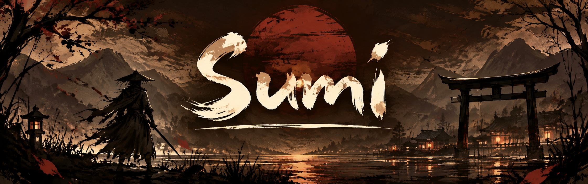
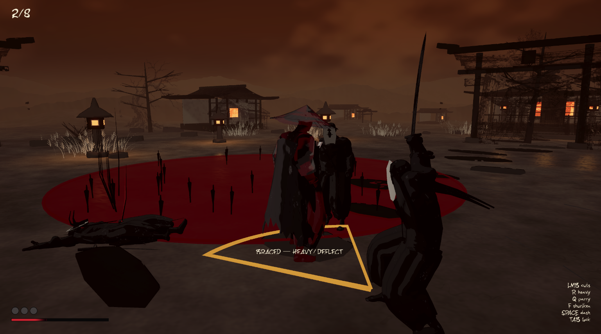
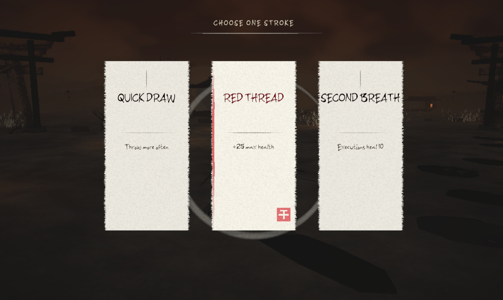

# Sumi

**Roguelite · A ronin's last chance.**

A ronin falls in battle. Death offers him one final chance to return. Caught between life and death, he must fight his way through the ink.

[Play in your browser](https://pranit-gandhi.itch.io/sumi)

## The game

Third-person katana combat in an ink-inspired shrine. Chain cuts, time a perfect parry, and dash through danger. Survive the arena waves, choose spells that change your run, and confront the Painted Oni.

- A three-hit sword combo, heavy attacks, guard, and timed deflections.
- Brush Flash movement, target locking, shuriken, and low-health executions.
- Randomized spell choices, arrow hazards, and distinct enemy attack patterns.
- Ink dissolution, brushwork menus, and a restrained red and sepia palette.

## In-game screenshots





## Controls

- **WASD** to move; **Shift** to jog.
- **Mouse** to look; **Left Mouse** to chain cuts.
- **R / Middle Mouse** for a heavy attack.
- **Right Mouse** to guard; **Q** to parry.
- **Space** to dash; **Tab** to toggle target lock.
- **E** to execute; **F** to throw a shuriken.
- **Esc** to pause.

## Development

Built with **Unity 6000.2.14f1**, **C#**, and **Universal Render Pipeline 17.2.0**. The browser version uses WebGL.

1. Open the repository in Unity 6000.2.14f1.
2. Open `Assets/Scenes/SumiShrine.unity`.
3. Enter Play Mode.

Combat tuning lives in `Assets/Sumi/Resources/Sumi/Attacks/`. See [COMBAT.md](COMBAT.md) for move timing, follow-ups, and combat checks.

With Unity open at the project root, build and package the browser version:

```powershell
python Tools/editor.py SumiBuild.WebGL
python Tools/package_itch.py
```

The build is written to `Builds/WebGL`; the upload package is `Builds/Sumi-itch.zip`. Local builds and Unity-generated folders are excluded from source control. Rebuild to distribute changes made after the last browser release.

Create a branch from `main` when collaborating, and commit Unity assets together with their `.meta` files. Exercise changed gameplay in Play Mode and check the Console before opening a gameplay PR. `SumiHumanoidBuild.Build` recreates an older outfit; use `SumiCharacterArt.Apply` only when intentionally regenerating the current character art.

## Credits

Co-developed by **Pranit Singh Gandhi** and **Naxin Chen**.

See [ATTRIBUTIONS.md](ATTRIBUTIONS.md) for asset sources and license terms. The cover art is shown above; the gallery contains in-game screenshots.
